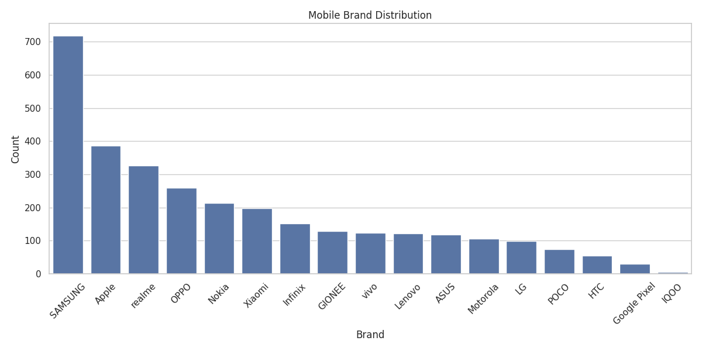
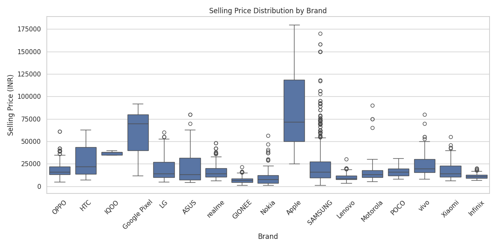
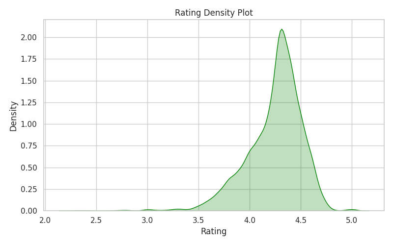
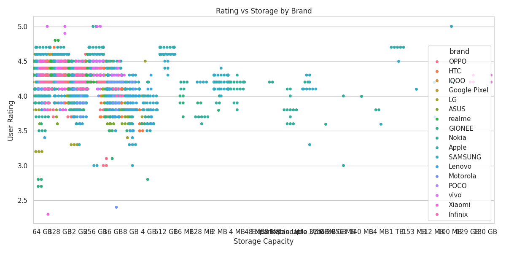
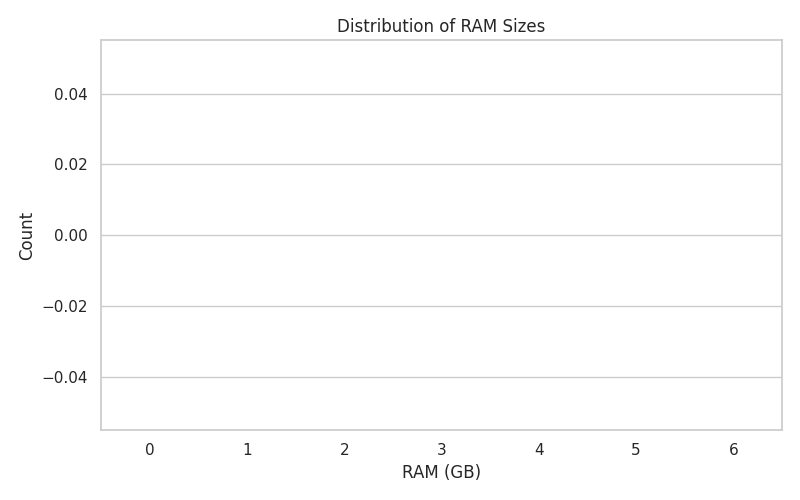
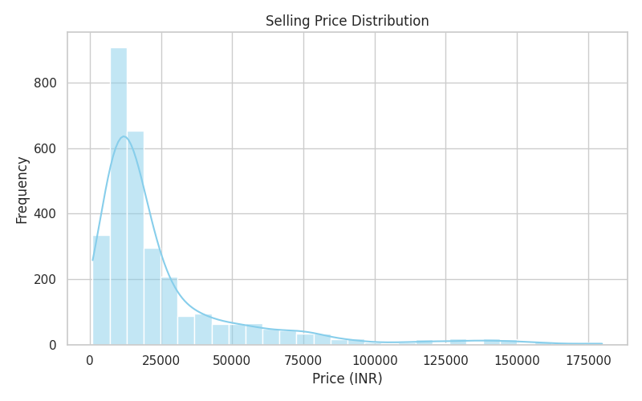
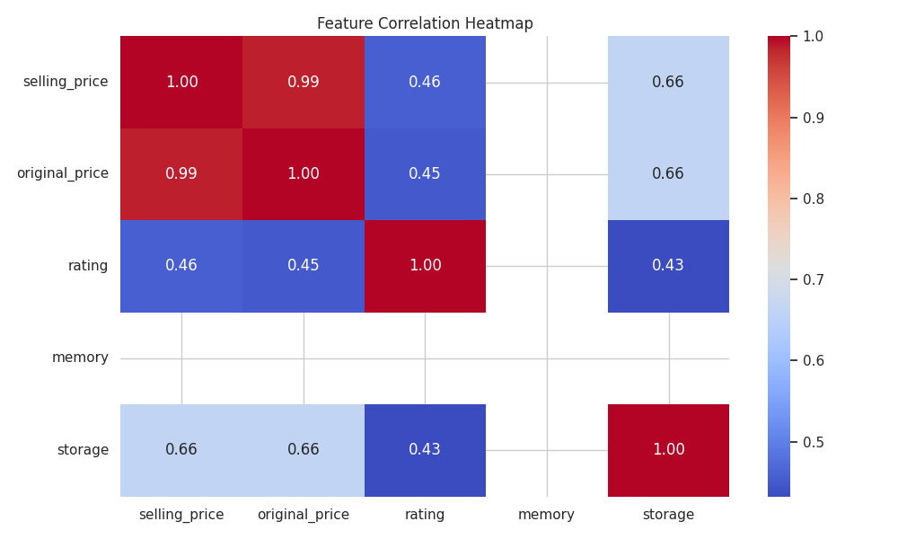

## 📌 Project Overview
This project explores *Flipkart Mobile Listings* using *Python, Pandas, Matplotlib, and Seaborn*.  
The goal is to uncover pricing patterns, brand popularity, and feature-based trends through *exploratory data analysis (EDA)* and visual storytelling.

# Create project folder
mkdir DATA-TRAIN
cd DATA-TRAIN

# Create subfolders
mkdir figures
mkdir data

# Create dataset placeholder
echo "brand,model,memory,storage,rating,original_price,selling_price" > data\flipkart_mobiles.csv

# Create notebook placeholder
echo "# Flipkart Mobile Data Analysis Notebook" > task_notebook.ipynb

# Create requirements.txt
echo pandas`nmatplotlib`nseaborn > requirements.txt

# Create README.md with full content
@"
# 📱 Flipkart Mobile Data Analysis


## 📂 Dataset
- *File*: flipkart_mobiles.csv  
- *Description*: The dataset contains mobile phone listings scraped from Flipkart, including:  
  - `brand` → Mobile brand (e.g., Samsung, Xiaomi, Apple)  
  - `model` → Device model name  
  - `memory` → RAM size (e.g., 4 GB, 6 GB)  
  - `storage` → Internal storage (e.g., 64 GB, 128 GB)  
  - `rating` → User rating (out of 5)  
  - `original_price` → Listed original price  
  - `selling_price` → Discounted price  

## 📁 File Structure

DATA-TRAIN/
│── flipkart_mobiles.csv         # Dataset
│── task_notebook.ipynb          # Jupyter Notebook with all code & analysis
│── figures/                     # Folder containing saved graphs
│   ├── barplot_brand.png
│   ├── boxplot_price.png
│   ├── kdeplot_rating.png
│   ├── violinplot_memory.png
│   ├── swarmplot_storage_rating.png
│   ├── countplot_memory.png
│   ├── histogram_price.png
│   ├── heatmap_correlation.png
│── README.md                    # Project documentation (this file)
│── requirements.txt             # Python dependencies

## 📊 Visualizations & Insights

### 1. Brand Distribution
  
- *Xiaomi and Samsung* dominate the listings.  
- Vivo and OPPO follow closely, while premium brands like *Apple* appear less frequently.

### 2. Selling Price by Brand
  
- *Apple and Samsung* show wide price ranges.  
- Budget brands like *Realme and Infinix* cluster in lower price brackets.

### 3. Rating Density
  
- Most phones are rated between *4.0 and 4.5*.  
- Very few listings fall below 3.5, indicating high customer satisfaction.

### 4. Selling Price by RAM
  
- Higher RAM generally correlates with higher price.  
- Some *4GB models* are priced unusually high, possibly due to brand or features.

### 5. Rating vs Storage by Brand
  
- Brands like *Samsung and Xiaomi* maintain high ratings across storage tiers.  
- *OPPO and Vivo* show more variability in user satisfaction.

### 6. RAM Size Distribution
  
- *4GB and 6GB* RAM configurations are most common.  
- *8GB and above* are less frequent, indicating premium segment.

### 7. Selling Price Histogram
  
- Most phones fall in the *₹10,000–₹20,000* range.  
- A few premium models exceed ₹50,000.

### 8. Feature Correlation Heatmap
  
- *Selling price* is strongly correlated with *original price*.  
- Moderate correlation with *RAM and storage*, weak with *rating*.

## 🛠 Tech Stack
- *Language*: Python 🐍  
- *Libraries*: Pandas, Matplotlib, Seaborn  
- *Environment*: Jupyter Notebook  

## 🚀 How to Run

1. Clone the repo:
   ```bash
   git clone https://github.com/Yesh6957/Data-train.git
   cd Data-train
 Install dependencies:

    bash
     pip install -r requirements.txt
Launch Jupyter Notebook:

     bash
     jupyter notebook
- Open task_notebook.ipynb and run all cells to generate visualizations.
##✅ Conclusion
This project demonstrates how exploratory data analysis (EDA) can uncover meaningful insights from e-commerce listings. 
From brand dominance to pricing strategies and feature-based satisfaction trends, the analysis provides a comprehensive view of the mobile market on Flipkart.
It also showcases practical skills in data cleaning, visualization, and storytelling—essential for any data-driven portfolio.
